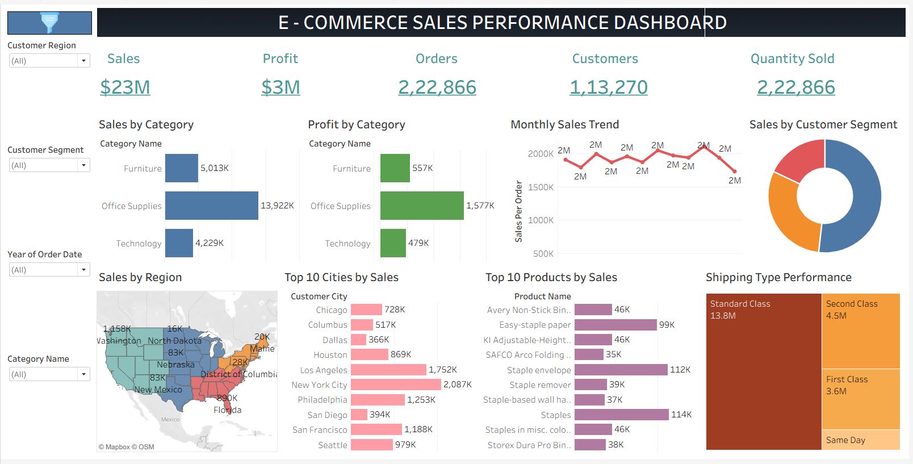

# 📊 E-Commerce Sales Performance Dashboard

##  Project Overview

It is an interactive Tableau dashboard developed to analyze e-commerce sales performance across different customer segments, regions, product categories, shipping methods and time periods. It provides key business insights using interactive visualizations and filters to support data-driven decision-making.

---

##  Dashboard Features

- 📊 Sales KPI
- 💰 Profit KPI
- 📦 Total Orders KPI
- 👥 Total Customers KPI
- 🛒 Quantity Sold KPI
- 📊 Sales by Category
- 💹 Profit by Category
- 📈 Monthly Sales Trend
- 🍩 Sales by Customer Segment
- 🗺️ Sales by Region
- 🏙️ Top 10 Cities by Sales
- 📦 Top 10 Products by Sales
- 🚚 Shipping Type Performance

---

##  Tools Used

- Tableau Desktop
- Data Visualization
- Dashboard Design
- Data Analysis

---

##  Key Insights

- Office Supplies recorded the highest sales.
- Consumer Segment contributed the most revenue.
- Standard Class was the most used shipping mode.
- Interactive filters enable dynamic sales analysis.

---

##  Skills Demonstrated

- Data Visualization
- Dashboard Design
- KPI Development
- Interactive Filtering
- Business Intelligence
- Data Analysis

---

##  Dashboard Preview

---

##  Author

**Ridhuvarshini N.**
